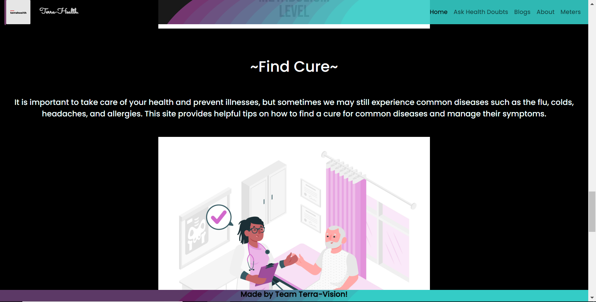
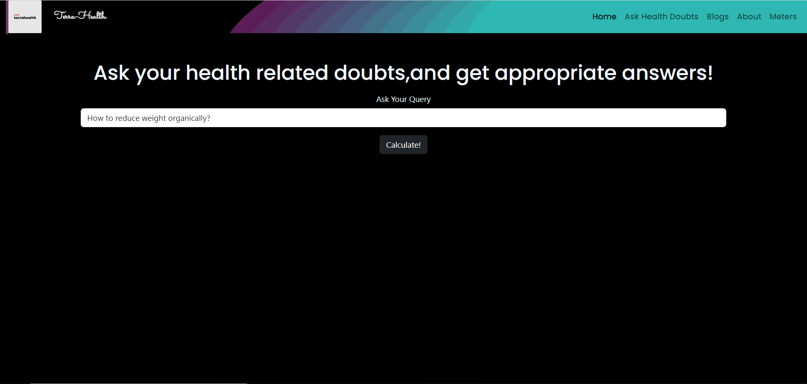
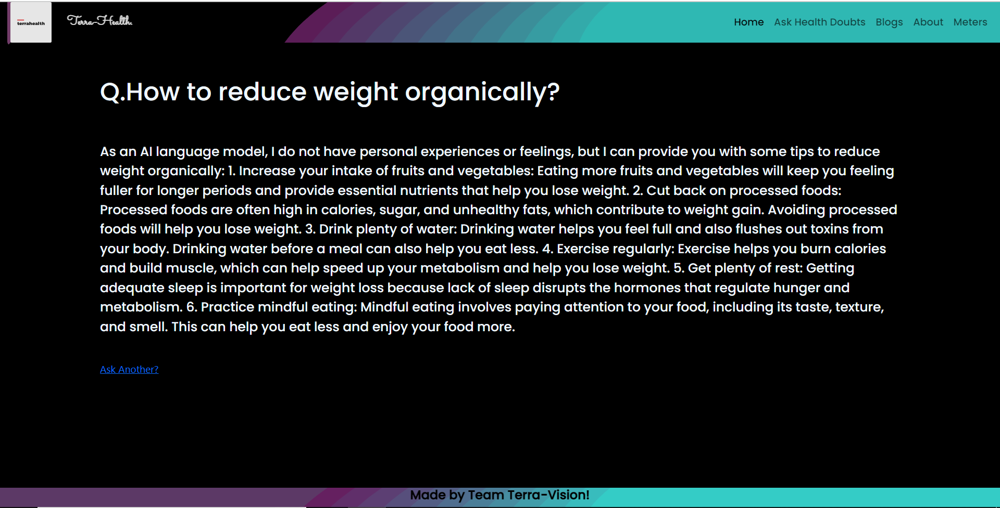
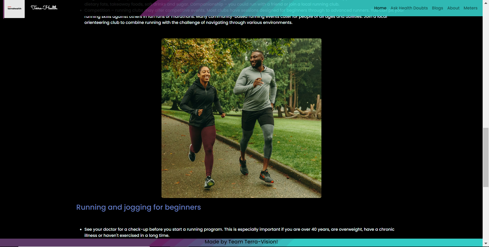
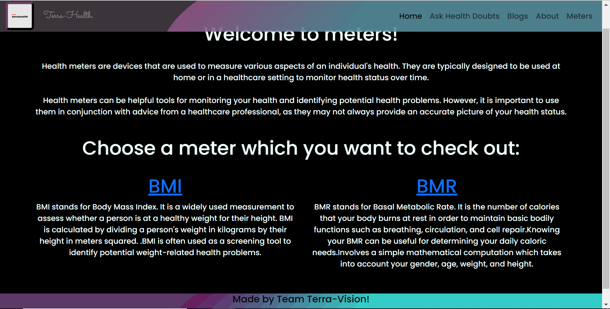
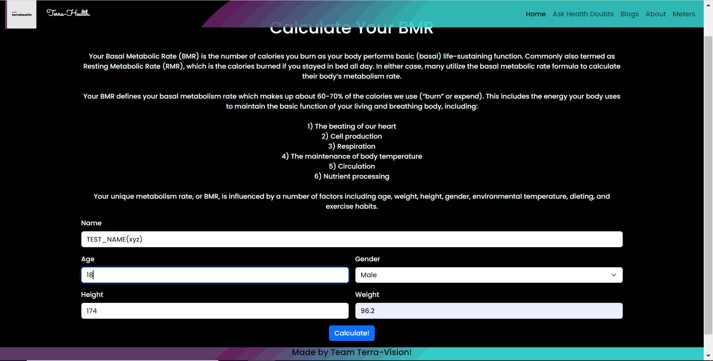

<h1 align="center" id="title">TerraHealth</h1>

<p align="center"></p>

<p id="description">Healthcare is one of the most crucial aspects of our lives and having access to reliable information and resources can significantly impact our well-being. With the advent of the internet accessing health-related information has become more accessible. However the vast amount of information available online can be overwhelming and confusing for users. To address this issue We developed a healthcare website that provides a range of features to promote health awareness and help users take control of their fitness.Our vision is to create a comprehensive health care website that empowers users to take control of their well-being. Our idea is to provide a platform where users can get answers to their health-related queries access informative blogs for health awareness and use meters for fitness calculations. We believe that by offering these features we can promote healthier lifestyles and help people achieve their health goals. The website's real-life use case is significant as it provides a range of resources and tools to help users take control of their health. The informative blogs can help users stay up-to-date on the latest health trends and research which will be updated in future/even be changed so as to provide poeple the freedom to publish their own blogs while the fitness meters can help them track their progress and make informed decisions about their fitness goals. The chatbot powered by GPT-3.5 can be especially beneficial for users who have specific health-related questions or concerns that they want to address.</p>
<center>

</center>
<h2>🚀 Demo</h2>
<a href="https://drive.google.com/file/d/1RySc2TJaPxLZVx3JMXqbXbkeY-PKUCKU/view?usp=drive_link" >Click Here!</a>
[https://drive.google.com/file/d/1RySc2TJaPxLZVx3JMXqbXbkeY-PKUCKU/view?usp=drive\_link](https://drive.google.com/file/d/1RySc2TJaPxLZVx3JMXqbXbkeY-PKUCKU/view?usp=drive_link)

# In-App Images:









![failed 

<h2>🛠️ Installation Steps:</h2>

<p>1. Fork the Repo and Open in Code Terminal</p>

<p>2. Install Dependencies</p>

```
npm install
```

<p>3. Run the server locally at</p>

```
https://localhost:1080/
```

<h2>🍰 Contribution Guidelines:</h2>

Open a PR or Notify us with issues!


  
<h2>💻 Built with</h2>

Technologies used in the project:

*   EJS
*   Node.js
*   Express.js
*   SQL
*   Javascript
*   RapidAPI
*   Vercel
*   Render

<h2>🛡️ License:</h2>

This project is licensed under the GPL-3.0 license
